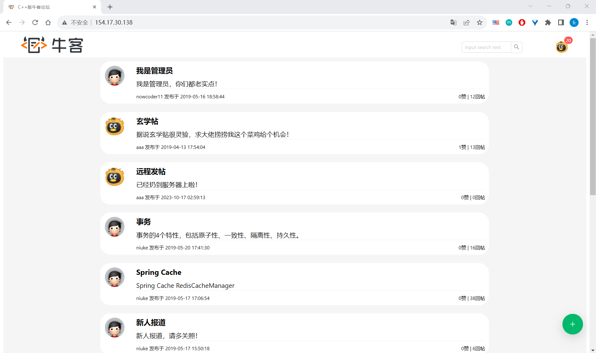

<h1 align = "center">C++版牛客论坛 </h1>  

## Demo展示

 __部署于[154.17.30.138](http://154.17.30.138/)，可实际体验__  
用户名：aaa; 密码：aaa  
或者愿意收邮件注册也可以  
登录不了可能因为人机认证用了谷歌reCaptcha，要点了才能登录

## 技术特点
1. MariaDB数据库（MySQL分支）
2. Redis缓存
3. Kafka消息队列
4. 前后端分离
5. 船新的C++版本牛客论坛项目，拥有它你就是不一样的烟火

## 安装说明
我去，c++环境配起来太恶心了，等我缓缓再说

## 后记
终于实现了准备C++面试时的梦想。但还是说，能接受Java那写起来舒服太多了。

