<h1 align = "center">C++版牛客论坛 </h1>  

## Demo展示

<br>__部署于[nowcoder.jvlla.com](http://nowcoder.jvlla.com)，可实际体验__  
用户名：aaa; 密码：aaa  
或者愿意收邮件注册也行  
登录不了可能因为人机认证用了谷歌reCaptcha，要能访问才能登录

## 实现说明
### 整体架构
<div align="center">
	
</div>  

### 类间关系
<div align="center">
	
</div>  

### 调用时序（以点赞业务为例）

### 技术选型
<table align="center">
    <tr>
        <td align="center">数据库</td>
        <td align="center">MariaDB</td>
    </tr>
    <tr>
        <td align="center">缓存</td>
        <td align="center">Redis</td>
    </tr>
	<tr>
        <td align="center">消息队列</td>
        <td align="center">Kafka</td>
    </tr>
	<tr>
        <td align="center">整体架构</td>
        <td align="center">前后端分离</td>
    </tr>
</table>

## 使用教程
仅保证Ubuntu20可用(太邪门了，系统换个版本都一堆问题)

安装依赖
```
sudo apt update
sudo apt install vim
sudo apt install git
sudo apt install build-essential
sudo apt install cmake
sudo apt install openssl libssl-dev
```


安装后端环境
```
# 安装libcurl
sudo apt install libcurl4-openssl-dev

# 安装nlohmann_json
git clone https://github.com/nlohmann/json.git
cd json
mkdir build && cd build
cmake ..
sudo make install
cd ~

# 安装jwt-cpp
git clone https://github.com/Thalhammer/jwt-cpp.git
cd jwt-cpp
mkdir build && cd build
cmake ..
sudo make install
cd ~

# 安装mariaDB数据库
sudo apt install mariadb-server
sudo apt install libmariadb-dev-compat libmariadb-dev libmariadbclient-dev

# 安装Redis
sudo apt install redis-server libhiredis-dev

# 安装Kafka，参照https://www.jianshu.com/p/ab005f8f3e26
sudo apt install openjdk-8-jdk
wget https://archive.apache.org/dist/kafka/2.4.0/kafka_2.13-2.4.0.tgz  # 网址要是失效了就找个类似的吧
tar -zxvf kafka_2.13-2.4.0.tgz
cd kafka_2.13-2.4.0
vim config/server.properties
# 修改
# broker.id=1
# listeners=PLAINTEXT://localhost:9092
# advertised.listeners=PLAINTEXT://localhost:9092
bin/zookeeper-server-start.sh -daemon config/zookeeper.properties  # 启动zookeeper
bin/kafka-server-start.sh -daemon config/server.properties  # 启动Kafka
cd ~

# 安装rdkafka客户端库
git clone https://github.com/confluentinc/librdkafka.git
cd librdkafka
mkdir build && cd build
cmake ..
sudo make install
cd ~

# 安装drogon，注意要保证已安装MariaDB和Redis(否则会出现找不到数据库问题)
# 与https://github.com/drogonframework/drogon-docs/blob/master/CHN-02-%E5%AE%89%E8%A3%85.md相同
sudo apt install libjsoncpp-dev
sudo apt install uuid-dev
sudo apt install zlib1g-dev
git clone https://github.com/drogonframework/drogon
cd drogon
git submodule update --init
mkdir build && cd build
cmake ..
make && sudo make install
cd ~
```

安装前端环境
```
# npm安装和升级
sudo apt install nodejs npm
sudo npm install -g n
sudo n 16  # 18有的系统前端代理会报错 Error: connect ECONNREFUSED
# 退出终端重新进，不然cannot find module 'semver'错误 !!!!!!!!!!!!!!!!!!!!!!!!!!
```

下载项目
```
git clone https://github.com/jvlla/nowcoder_cpp_front-end.git
git clone https://github.com/jvlla/nowcoder_cpp_back-end.git
```


处理数据库
```
# 数据库改密码
mysql
ALTER USER 'root'@'localhost' IDENTIFIED BY 'admin';
flush privileges;
exit;
# 加载网站初始数据
cd nowcoder_cpp_back-end/
mysql -uroot -p
source ./nowcoder.sql
quit;
cd ~
```

修改IP地址（远程运行）
```
修改后端config.json第18行的0.0.0.0为实际IP地址
修改前端vite.config.ts第9行的localhost为实际IP地址
```


编译运行项目
```
#前端
cd nowcoder_cpp_front-end/
npm i react-router-dom@6 axios nprogress antd@5 @ant-design/icons react-google-recaptcha
npm add @types/react
# 运行前端
(npm run nowcoder -- --host &)  # 后台运行且外网访问
# npm run nowcoder  # 本地运行
```

```
# 后端
cd nowcoder_cpp_back-end/build
mkdir log
cmake ..  # 不知道为啥说找不到rdkafka，但反正后面能编译，凑合吧
make
nohup ./nowcoder_back-end &  # 后台运行
# ./nowcoder_back-end  # 本地运行
```

## 部分需修改参数说明
config.json部分参考[官方文档](https://github.com/drogonframework/drogon-docs/blob/master/CHN-10-%E9%85%8D%E7%BD%AE%E6%96%87%E4%BB%B6.md)  
实际接收邮件注册，修改UserService.cc的127-137行为你的邮箱和SMTP授权码  
实际远程运行，在[这里](https://www.google.com/recaptcha/admin)注册你的google reCAPTCHA密码，并相应修改后端LoginController.cc第242行和前端login.tsx第114行

## 后记
终于实现了准备C++面试时的梦想。但还是说，能接受Java那写起来还是要舒服不少，配环境更是没法比。
